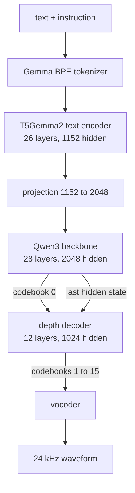

# Architecture

This is a from scratch C++ port of Breeze-TTS-2 on top of ggml. Where the
reference uses PyTorch modules, this repo builds ggml graphs; the maths is meant
to match exactly.

## Pipeline



One backbone step produces one frame. A frame is 16 codebook entries and
becomes 1920 samples, so generation runs at 12.5 frames per second.

## Text encoder

T5Gemma2, 26 layers, hidden 1152, 4 query heads over 1 KV head, head dim 256,
FFN 6912, `gelu_pytorch_tanh`.

Two details are easy to get wrong and both produce speech that is intelligible
but paced incorrectly:

**Attention is bidirectional.** `T5Gemma2SelfAttention` sets `is_causal=False`.
The sliding layers use an asymmetric bidirectional window: with
`left = (w + 1) / 2` and `right = w / 2 + 1`, a key at distance `d = q - kv` is
visible when `0 <= d < left` or `0 < -d < right`. Applying a causal mask here
makes the model emit far too few frames for the text.

**RMSNorm is Gemma style.** `T5Gemma2RMSNorm` computes `x_norm * (1 + w)`, and
the weights are stored centred on zero. The converter bakes the `+1` in so the
runtime uses a plain RMSNorm.

Layers alternate between sliding window and full attention, with full attention
every sixth layer, and the two kinds use different RoPE settings: theta 1e6 with
a linear factor of 8 for full layers, theta 1e4 for sliding layers.

## Backbone

Qwen3, 28 layers, hidden 2048, 16 query heads over 8 KV heads, head dim 128,
FFN 6144, RoPE theta 1e6, with QK normalisation.

It reads the projected encoder output plus the running audio embedding and
predicts codebook 0 through a 2048 to 2052 head. Token 2051 ends the utterance;
tokens 2048 to 2050 are suppressed during sampling.

The audio embedding for a frame is the sum of the 16 codebook embeddings, each
looked up at `codebook_index * vocab_size + token` in one shared table.

## Depth decoder

12 layers, hidden 1024, 8 query heads over 2 KV heads, head dim 128, FFN 8192,
RoPE theta 5e5 with llama3 scaling. No QK normalisation.

For every frame it runs 15 short autoregressive steps to fill codebooks 1 to 15.
The KV cache is cleared at the start of each frame.

Position 0 takes the backbone's last hidden state as its input embedding.
Position `p` for `p >= 1` takes the token of codebook `p - 1`, offset by
`(p - 1) * vocab_size` into the shared embedding table, and the logits at that
position use head `p - 1`. The head weight is a `(15, 2051, 1024)` tensor sliced
per codebook.

## Vocoder

The vocoder is `Qwen3TTSTokenizerV2`, loaded from the `audio_tokenizer/`
directory. The Mimi codec inside the main checkpoint is dead weight; the
reference never touches it at inference time, and using it produces garbled
audio.

Its encoder is a Mimi model (SEANet plus transformer plus split RVQ) and is only
needed for voice cloning. Its decoder is a different network entirely:

```
codes [16, T]
  split residual quantizer      first codebook + sum of the other 15, both projected to 512
  causal conv 512 to 1024, k=3
  transformer                   8 layers, hidden 512, 16 heads, head dim 64,
                                SwiGLU, per branch layer scale, causal
                                sliding window 72, RoPE theta 1e4
  2x ConvNeXt upsample          transposed conv stride 2, then depthwise k=7,
                                LayerNorm, 1024 to 4096 to 1024, gamma scale
  causal conv 1024 to 1536, k=7
  4x decoder block              SnakeBeta, transposed conv at rates 8, 5, 4, 3,
                                then 3 residual units at dilations 1, 3, 9
  SnakeBeta, causal conv 96 to 1, k=7
  clamp to [-1, 1]
```

Total upsampling is `8 * 5 * 4 * 3 * 2 * 2 = 1920`, matching one frame.

SnakeBeta is `x + sin(x * alpha)^2 / beta`, where `alpha` and `beta` are stored
in log space and exponentiated at runtime.

Causal convolutions left pad by `(k - 1) * dilation - (stride - 1)` and never
pad on the right. Causal transposed convolutions run the transpose then trim
`k - stride` from the right, which is the same as keeping the first
`L * stride` samples.

## Classifier free guidance

When `cfg_scale != 1` the text encoder, backbone and depth decoder all run twice,
once on the conditioned prompt and once on a negative prompt that drops the
instruction. Logits combine as:

$$\text{logits} = \text{uncond} + s \cdot (\text{cond} - \text{uncond})$$

The depth decoder runs both branches in **one graph**, not two. Its cost is
dominated by dispatch overhead rather than arithmetic, so a second branch that
rides along in the same dispatches is close to free: 33.73 ms per frame at
`cfg_scale` 1 against 40.76 ms at 4, a 21% increase rather than a doubling.

The two branches share one KV cache, interleaved as
`slot = pos * n_branch + branch`. That keeps the tokens written each step
contiguous, so the cache append is a single copy, and
`build_branch_causal_mask` makes each query causal within its own branch and
blind to the other.

The backbone still runs its branches separately, because the conditioned and
unconditioned prompts have different lengths and do not interleave cleanly. That
is the remaining cost of guidance, worth about 6 ms per frame.

Measured end to end for voice direction with a cloned reference on an RTX 3060:

| `cfg_scale` | Backbone | Depth | Vocoder | Total per frame | Real time factor |
| --- | --- | --- | --- | --- | --- |
| 1 | 8.26 ms | 33.73 ms | 11.79 ms | 53.78 ms | 1.49x |
| 4 | 14.58 ms | 40.76 ms | 11.06 ms | 66.40 ms | 1.20x |

Cloning adds a one off reference encode of roughly 650 ms, which lands on time to
first audio and not on throughput.

## Streaming

Audio is flushed in growing chunks. The first is 4 frames (320 ms) so playback
can start early, and each flush grows by a third up to 25 frames (2 s) by
default, which keeps the vocoder running on batches big enough to amortise its
fixed cost. On an RTX 3060 at Q4_K that puts time to first audio around 350 ms
against roughly 1.35 s for a fixed 25 frame chunk. Both ends of the ramp are
configurable, see [server.md](server.md).

Each flush decodes with `sliding_window + 16` frames of left context and
discards the audio belonging to that context. The transformer window alone is
not enough: the convolutions either side of it reach back about another 16
frames, and truncating there costs about 8 dB against a single pass decode.

That context is re-decoded every flush, so the chunk size sets how much vocoder
work is thrown away. A 25 frame chunk decodes 113 frames to emit 25. Going to 40
frames takes the vocoder from 13.15 to 10.87 ms per emitted frame, which is worth
about 7% off total generation time. Past 40 there is nothing left to reclaim.

Chunking also shapes what the client has to do. The queue drains continuously but
refills once per chunk, so a client needs to hold more audio than a chunk takes
to produce, not merely delay its first chunk. Producing 40 frames takes about
2.5 s, so a client sitting on 0.5 s runs dry even when the average rate is well
ahead of playback.

## Where the time goes

Measured on an RTX 3060 at Q8_0, per frame of audio (80 ms):

| Stage | Per frame | Share |
| --- | --- | --- |
| Backbone decode | 9.9 ms | 15% |
| Depth decode | 42.1 ms | 63% |
| Vocoder | 13.2 ms | 20% |

The depth decoder dominates because it runs 15 sequential steps per frame, one
per codebook, and each step is a full 12 layer forward pass over a single token.

It is bound by dispatch count, not arithmetic. Splitting `Graph::compute` over a
whole clip attributes 4.5% to graph allocation, 7.1% to input uploads and 80% to
`ggml_backend_graph_compute`, while the GPU reports 63% mean utilisation. The
work per dispatch is tiny and there are roughly 180 of them per step, so the
device spends much of its time between kernels rather than inside them. The
reference implementation reaches for CUDA graphs on exactly this module; ggml's
Vulkan backend has no equivalent, and the single shared backend and allocator
rule out overlapping stages across threads.

## ggml notes

Things worth knowing if you touch the graph code.

**Graph pattern.** Build the graph, call `ggml_gallocr_alloc_graph`, then set
input tensor data, then compute. Inputs cannot be written before allocation
because their backing memory does not exist yet. `Graph` in
[common.h](../include/breeze/common.h) stashes pending inputs and writes them at
the right moment.

**No grouped convolutions.** ggml convolution ops ignore groups. Depthwise
kernels are applied as a shift and multiply over `k` shifted views instead of
being expanded into a block diagonal matrix.

**Convolution kernels must be F32.** The Vulkan `conv_transpose_1d` path rejects
F16 inputs, so the converter pins every convolution kernel to F32 regardless of
the requested dtype.

**`ggml_conv_1d` uses an F16 im2col.** Activations round to F16 inside every
convolution. Measured against a full F32 path the difference is about 78 dB SNR,
which is inaudible, so it is left alone.

**Tensor layouts.** Convolution stages use `[length, channels]` with time in
`ne0`. Transformer stages use `[hidden, tokens]` with hidden in `ne0`. Transpose
between them, matching the reference's `transpose(1, 2)` and `permute(0, 2, 1)`.

## Source map

| File | Contents |
| --- | --- |
| `src/common.cpp` | Backend init, KV cache, graph helper, attention, masks |
| `src/gguf_loader.cpp` | GGUF loading and backend tensor allocation |
| `src/config.cpp` | Metadata to config structs |
| `src/tokenizer.cpp` | Gemma BPE with byte fallback |
| `src/text_encoder.cpp` | T5Gemma2 encoder |
| `src/backbone.cpp` | Qwen3 backbone and audio embedding |
| `src/depth_decoder.cpp` | Depth decoder and llama3 RoPE scaling |
| `src/codec.cpp` | Vocoder entry points |
| `src/codec_conv.cpp` | Causal convolution helpers and the SEANet encoder |
| `src/codec_transformer.cpp` | Mimi encoder transformer and vocoder transformer |
| `src/codec_decoder.cpp` | Quantizer decode, ConvNeXt, SnakeBeta, decoder blocks |
| `src/sampling.cpp` | Repetition penalty, temperature, top-k, top-p |
| `src/generation.cpp` | Prompt assembly, generation loop, chunked flush |
| `src/c_api.cpp` | C ABI wrapper |
